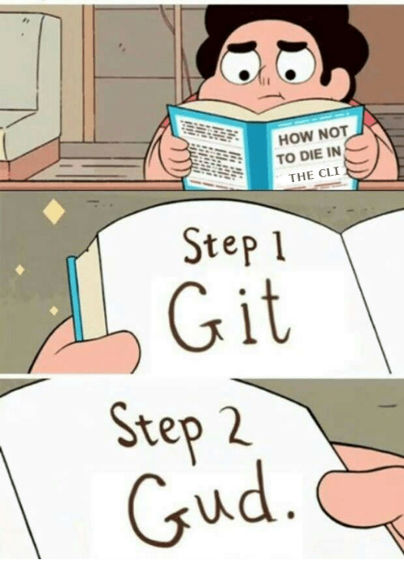
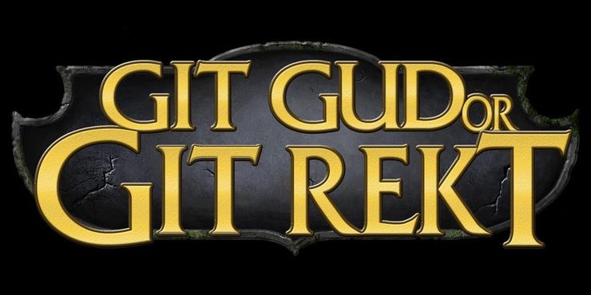

title: Git Gud - Tips and Tricks
author:
name: James Freeman
twitter: developervert
url: https://jammaloo.com
output: index.html
style: git-style.css
theme: sudodoki/reveal-cleaver-theme

--

# Git Gud
## Hidden tricks that can save you time

--



--

# What we think git is

--

```bash
➜  git_goodness git:(develop) git merge my_branch
Auto-merging there
CONFLICT (content): Merge conflict in there
Auto-merging hi
CONFLICT (content): Merge conflict in hi
Automatic merge failed; fix conflicts and then commit the result.
➜  git_goodness git:(develop) ✗ git pull
error: Pulling is not possible because you have unmerged files.
        hint: Fix them up in the work tree, and then use 'git add/rm <file>'
hint: as appropriate to mark resolution and make a commit.
        fatal: Exiting because of an unresolved conflict.
```

--

# What git actually is

--

```console
➜  git_goodness git:(develop) git merge my_branch
Auto-merging there
CONFLICT (content): Merge conflict in there
Auto-merging hi
CONFLICT (content): Merge conflict in hi
Automatic merge failed; fix conflicts and then commit the result.
➜  git_goodness git:(develop) ✗ git pull
error: Pulling is not possible because you have unmerged files.
        hint: Fix them up in the work tree, and then use 'git add/rm <file>'
hint: as appropriate to mark resolution and make a commit.
        fatal: Exiting because of an unresolved conflict.
```

--


--

### Git is hard

Git is complex, but it has some nice features

* Conditional Configs
* Patch Mode
* Bisects
* Change based searches
* Blame

--

### Conditional Configs

Use includeIf to load a config based on the directory or git branch.

###### ~/.gitconfig
```yaml
[user]
        name = James Freeman
        email = james@jammaloo.com

[includeIf "gitdir:~/Development/apollo/"]
        path = .gitconfig-apollo
```

###### ~/.gitconfig-apollo
```yaml
[user]
        name = James Freeman
        email = james@apollo350.com
```

--

<script id="asciicast-6xjV7Kso9DtEc9xNSNPcxcjo8" src="https://asciinema.org/a/6xjV7Kso9DtEc9xNSNPcxcjo8.js" async></script>

--

### Patch Mode

Add the `-p` flag when committing, so you can pick and choose what to add

<script id="asciicast-gsWSJjqsb4O5vS6XppLVaJ3DH" src="https://asciinema.org/a/gsWSJjqsb4O5vS6XppLVaJ3DH.js" async></script>

--

### Okay, but how can git help me find bugs?

Great question, imaginary audience member, you have a good brain.

Let's look at 3 different techniques for narrowing down when a "bug" was introduced into a text file.

```text
99 little bugs in the code,
99 little pugs.
Take one down,
patch it around,
117 little bugs in the code.
```

That second line says `pugs` not `bugs`, let's find when that change happened!

--

### Blame

Git lets you play the blame game, by running `git blame <file>`. This tells you the last commit that changed each file, and who made that commit.

```bash
[jammaloo@jammaloo bugs]$ git blame lyrics
^fd8dfc3 (James Freeman 2021-01-29 00:43:20 -0500 1) 99 little bugs in the code,
4060da07 (Drunk James   2021-01-29 00:44:39 -0500 2) 99 little pugs.
^fd8dfc3 (James Freeman 2021-01-29 00:43:20 -0500 3) Take one down,
^fd8dfc3 (James Freeman 2021-01-29 00:43:20 -0500 4) patch it around,
^fd8dfc3 (James Freeman 2021-01-29 00:43:20 -0500 5) 117 little bugs in the code.
```

Useful, but we can do better.

--

### Search the logs

use `git  log -G<text>` to find any commits that added or removed that string. This is especially useful when finding when something was _removed_ in a commit.

```bash
[jammaloo@jammaloo bugs]$ git log -Gpugs
commit 4060da0715cb4be1a1f3ee4f5661db6899aa5ea4 (HEAD -> master)
Author: Drunk James <james@jammaloo.com>
Date:   Fri Jan 29 00:44:39 2021 -0500

    Pranked ya
```

--

### Bisects

Bisects are powerful dark magic, that pinpoint exactly what commit introduced a bug using a binary search.

<script id="asciicast-qZstoL7ArNnP4NHmiXAstsLjo" src="https://asciinema.org/a/qZstoL7ArNnP4NHmiXAstsLjo.js" async></script>

--

### Bisects, but on steroids

Because you are just telling git if each commit is "good" or "bad", you can automate it!

Want to know when a test started failing?

`git bisect run node test`

--

### To be continued?



--